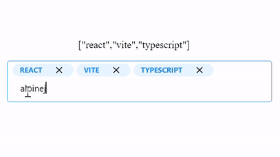

# mantine-tag-input
A react tag input built on mantine component library and it adapts well with the theme of the library.

[](https://github.com/Dellysn/mantine-tag-input/actions/workflows/publish.yml)





Installation
------------

To start using mantine Tag Input in your React project, follow these simple steps:

1.  Install the package via npm or yarn:

bash

```bash
npm install mantine-tag-input
```

or

bash

```bash
yarn add mantine-tag-input
```
or

bash

```bash
pnpm add mantine-tag-input
```
2.  Import the component in your desired file:

javascript

```javascript
import { TagsInput } from 'mantine-tag-input';
```

Props
-----

### name (optional)

*   Type: `string`
*   Default: `undefined`

The `name` prop allows you to specify the name attribute for the input field. This can be useful for form submission or accessing the input value via JavaScript.

### placeHolder (optional)

*   Type: `string`
*   Default: `undefined`

The `placeHolder` prop defines the placeholder text that appears in the input field when no tags are present.

### value (optional)

*   Type: `string[]`
*   Default: `[]`

The `value` prop accepts an array of strings representing the initial tags to be displayed in the input field.

### onChange (optional)

*   Type: `(tags: string[]) => void`
*   Default: `undefined`

The `onChange` prop is a callback function that is triggered whenever there is a change in the tags. It receives an array of strings representing the updated tags as a parameter.

### onBlur (optional)

*   Type: `any`
*   Default: `undefined`

The `onBlur` prop allows you to define a function that is called when the input field loses focus.

### separators (optional)

*   Type: `string[]`
*   Default: `undefined`

The `separators` prop allows you to specify an array of strings that will act as separators for creating multiple tags. By default, the tags are separated by commas.

### disableBackspaceRemove (optional)

*   Type: `boolean`
*   Default: `false`

The `disableBackspaceRemove` prop, when set to `true`, prevents the removal of tags by pressing the Backspace key.

### onExisting (optional)

*   Type: `(tag: string) => void`
*   Default: `undefined`

The `onExisting` prop is a callback function that is triggered when an existing tag is added. It receives the added tag as a parameter.

### onRemoved (optional)

*   Type: `(tag: string) => void`
*   Default: `undefined`

The `onRemoved` prop is a callback function that is triggered when a tag is removed. It receives the removed tag as a parameter.

### disabled (optional)

*   Type: `boolean`
*   Default: `false`

The `disabled` prop, when set to `true`, disables the input field and prevents any further interaction with the component.

### isEditOnRemove (optional)

*   Type: `boolean`
*   Default: `false`

The `isEditOnRemove` prop, when set to `true`, allows users to edit tags after they have been added.

### beforeAddValidate (optional)

*   Type: `(tag: string, existingTags: string[]) => boolean`
*   Default: `undefined`

The `beforeAddValidate` prop allows you to define a validation function that is called before a tag is added. The function receives the tag to be added and the existing tags as parameters, and should return a boolean value (`true` to allow the addition and `false` to prevent it).

### onKeyUp (optional)

*   Type: `(e: React.KeyboardEvent<HTMLInputElement>) => void`
*   Default: `undefined`

The `onKeyUp` prop is a callback function that is triggered when a key is released within the input field.

### size (optional)

*   Type: `'xs' | 'sm' | 'md' | 'lg' | 'xl'`
*   Default: `undefined`

The `size` prop allows you to specify the size of the input field. It accepts one of the following values: `'xs'`, `'sm'`, `'md'`, `'lg'`, or `'xl'`.

### error (optional)

*   Type: `React.ReactNode`
*   Default: `undefined`

The `error` prop allows you to display an error message below the input field. It accepts a React node as a value.

Example Usage
-------------

Here's an example that demonstrates how you can utilize the mantine Tag Input component with some of the available props:

javascript

```javascript
import { MantineTagsInput } from 'mantine-tag-input';

const MyComponent = () => {
  const handleTagChange = (tags) => {
    // Handle tag change logic here
  };

  const handleTagRemove = (tag) => {
    // Handle tag removal logic here
  };

  return (
    <MantineTagsInput
      name="tags"
      placeHolder="Enter tags..."
      value={['tag1', 'tag2', 'tag3']}
      onChange={handleTagChange}
      onRemoved={handleTagRemove}
      separators={[' ', ',']}
      disableBackspaceRemove={true}
      isEditOnRemove={true}
    />
  );
};
```

In this example, the `MyComponent` function renders the `TagsInput` component with several props configured. Adjust the prop values as per your requirements to fully customize the behavior of the mantine Tag Input component.

Congratulations! You are now equipped with the knowledge to utilize the mantine Tag Input component effectively in your React applications. Feel free to explore additional props and experiment with different configurations to suit your specific use cases.

Happy coding!